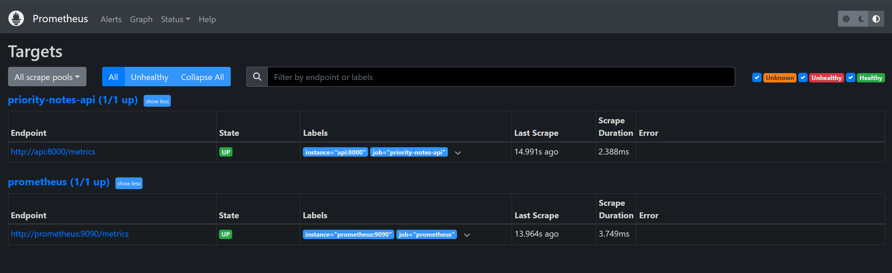
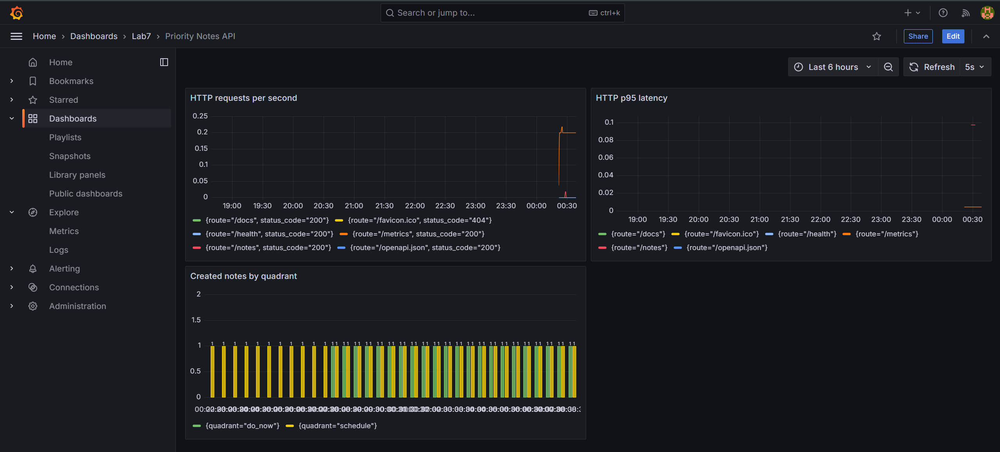
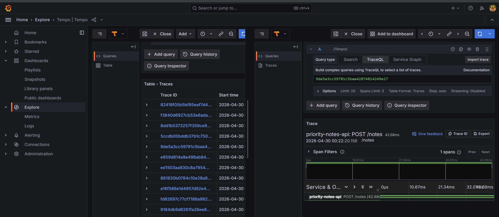

# Лабораторная работа №7: Observability

## Цель работы

В этой лабораторной работе я добавил наблюдаемость для своего приложения `Priority Notes API`.

Мне нужно было:

- добавить endpoint `/metrics` в формате Prometheus;
- настроить сбор метрик через Prometheus;
- сделать dashboard в Grafana;
- подключить distributed tracing через OpenTelemetry и Grafana Tempo;
- разделить код приложения и платформенный observability-стек.

## Что было сделано

В приложение я добавил файл:

```text
src/observability.py
```

В нем настроены:

- middleware для сбора HTTP-метрик;
- endpoint `/metrics`;
- счетчик запросов;
- histogram для времени ответа;
- бизнес-метрика по созданным заметкам;
- опциональный экспорт трейсов в Tempo через OTLP.

В `requirements.txt` я добавил зависимости:

```text
prometheus-client
opentelemetry-api
opentelemetry-sdk
opentelemetry-exporter-otlp
```

Трейсинг сделан опциональным. Если переменная `OTEL_EXPORTER_OTLP_ENDPOINT` не задана, приложение продолжает работать без Tempo.

## Метрики приложения

Я добавил следующие метрики:

```text
http_requests_total
http_request_duration_seconds
notes_created_total
```

`http_requests_total` показывает количество HTTP-запросов по методу, маршруту и статусу.

`http_request_duration_seconds` показывает время обработки HTTP-запросов.

`notes_created_total` является бизнес-метрикой. Она показывает, сколько заметок было создано по каждому quadrant:

```text
do_now
schedule
delegate
delete
```

Метрики доступны по адресу:

```text
http://localhost:8080/metrics
```

## Локальный запуск

Для локального запуска я использовал Docker Compose:

```bash
docker compose -f docker-compose.observability.yml up -d --build
```

Этот compose-файл поднимает:

- `postgres`
- `api`
- `prometheus`
- `grafana`
- `tempo`

После запуска сервисы доступны по адресам:

| Сервис | Адрес |
| --- | --- |
| API | `http://localhost:8080` |
| Metrics | `http://localhost:8080/metrics` |
| Prometheus | `http://localhost:9090` |
| Grafana | `http://localhost:3001` |
| Tempo | `http://localhost:3200` |

Для Grafana используются учебные учетные данные:

```text
admin / admin
```

## Проверка Prometheus

В Prometheus я открыл страницу:

```text
Status -> Target health
```

На ней видно, что Prometheus успешно собирает метрики с приложения. Job `priority-notes-api` находится в состоянии `UP`.



Это подтверждает, что endpoint `/metrics` доступен и Prometheus может его скрейпить.

## Проверка Grafana

В Grafana я открыл dashboard:

```text
Dashboards -> Lab7 -> Priority Notes API
```

На dashboard отображаются основные графики:

- количество HTTP-запросов;
- p95 latency;
- количество созданных заметок по quadrant.



Для появления данных я сделал несколько запросов к API:

```bash
curl http://localhost:8080/health
curl http://localhost:8080/notes
```

Также я создал тестовую заметку:

```bash
curl -X POST http://localhost:8080/notes \
  -H "Content-Type: application/json" \
  -d "{\"title\":\"Lab 7\",\"description\":\"Observability\",\"important\":true,\"urgent\":false}"
```

После этого на dashboard появилась активность по HTTP-запросам и по бизнес-метрике `notes_created_total`.

## Проверка Tempo

Для трейсов я использовал Grafana Tempo.

В Docker Compose для API заданы переменные:

```text
OTEL_EXPORTER_OTLP_ENDPOINT=http://tempo:4318
OTEL_SERVICE_NAME=priority-notes-api
```

После выполнения запросов к API я открыл в Grafana:

```text
Explore -> Tempo
```

Там я нашел trace для сервиса:

```text
priority-notes-api
```



На скриншоте видно, что Tempo получил trace по HTTP-запросу к API. Это подтверждает, что OpenTelemetry экспортирует трейсы в Tempo.

## Отдельный observability-каталог

По аналогии с лабораторной №6 я разделил приложение и платформенную часть.

В приложении `priority-notes-api` находятся:

- код API;
- Dockerfile;
- endpoint `/metrics`;
- OpenTelemetry SDK;
- compose-файл для полного локального запуска.

Отдельный платформенный каталог:

```text
../priority-notes-observability
```

В нем находятся:

- Prometheus config;
- Grafana datasources;
- Grafana dashboard;
- Tempo config;
- Kubernetes `ServiceMonitor`;
- Kubernetes-манифесты Tempo.

Такое разделение показывает промышленный подход: приложение отвечает за инструментирование, а observability-стек относится к платформенной части.

## Kubernetes-часть

Для Kubernetes я добавил в манифесты приложения переменные:

```text
OTEL_EXPORTER_OTLP_ENDPOINT=http://tempo.observability.svc.cluster.local:4318
OTEL_SERVICE_NAME=priority-notes-api
```

В отдельном каталоге `priority-notes-observability/k8s` лежат:

```text
namespace.yaml
tempo.yaml
servicemonitor.yaml
```

`ServiceMonitor` настроен на поиск Service приложения по label:

```text
app=priority-notes
```

Это позволяет Prometheus Operator находить приложение и собирать его метрики в Kubernetes.

## Итог

В результате я получил рабочую observability-схему:

```text
Priority Notes API -> /metrics -> Prometheus -> Grafana
Priority Notes API -> OTLP -> Tempo -> Grafana Explore
```

В отчете приложены обязательные скриншоты:

- Prometheus Targets: `prometheus-targets.png`;
- Grafana Dashboard: `grafana-dashboard.png`;
- Tempo Trace: `tempo-trace.png`.

Цель лабораторной выполнена: приложение экспортирует метрики, Prometheus их собирает, Grafana отображает графики, а Tempo принимает трейсы.
